  

  

  

  

---

## 🌌 About Me

- 🤖 **What I build**: Production-grade software across machine learning, computer vision, cloud infrastructure, and full-stack systems.
- 📚 **What I'm learning**: Advanced computer vision applications for environmental/agricultural monitoring and efficient ML deployment pipelines.
- 💡 **Fun Fact**: I monitor deforestation using satellite imagery, which means I'm technically watching the world's forests grow and shrink in real-time.

*I work on problems that produce a real, measurable output: something you can run, ship, and improve.*

---

## 🛠️ Tech Stack

#### 💻 Languages

#### 🧰 Frameworks & Libraries

#### 🛠️ Tools & DevOps

#### ☁️ Cloud & Databases

---

## 📊 GitHub Stats

  
  
  

  

  

---

## 🏆 Featured Projects

| Project | Description | Stack |
| :--- | :--- | :--- |
| 🌲 **[AI Forest Monitoring](https://github.com/psudharshanchowdary/AI-Forest-Monitoring-Impact-Assessment)** | End-to-end satellite image segmentation pipeline for deforestation detection. | `Python` `PyTorch` `YOLOv8` `ONNX` `Streamlit` `GEE` |
| 📷 **[CCTV AI Object Detection](https://github.com/psudharshanchowdary/ai-based-object-detection)** | Real-time CCTV object detection system with configurable alerts and snapshots. | `Python` `YOLOv8` `OpenCV` |
| 🍂 **[Bloom Diagnose](https://github.com/psudharshanchowdary/bloom-diagnose-ml)** | AI-powered crop disease detection and treatment recommendation from leaves. | `Python` `TypeScript` `Machine Learning` |
| ⚡ **[AWS Receipt Processor](https://github.com/psudharshanchowdary/aws-receipt-processor)** | Event-driven serverless pipeline for automated receipt management. | `Python` `AWS Lambda` `Textract` `DynamoDB` |

---

## 🚀 Currently Building

- 🛰️ Satellite image processing models for automated climate impact assessment
- 📦 Standardizing edge-device model deployment pipelines using ONNX and TensorRT
- ☁️ Designing serverless pipeline architectures on AWS

---

## 🤝 Connect With Me

  
  
  

  

